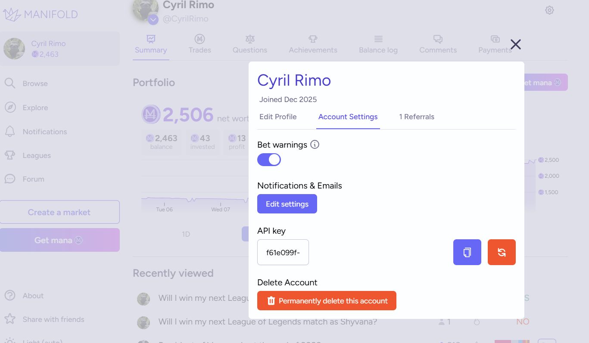

# LoL-Betting-Market
A Manifold Market application for placing bets on your League of Legends matches.

## Getting Started
### 0. Cloning the repository

You can clone the repository if you have remote Git set up on your system. Enter the following to clone the repo:

> git clone https://github.com/cyril-rimo/LoL-Betting-Market.git

Otherwise, you can download a ZIP file of the repo and move it into a working folder.

### 1. Manifold Markets API

You can get an API key from manifold.markets by signing up for a user account. Click on your profile image on the 
top left corner and go to Account Settings. Here, you can copy & paste and regenerate your API key.



### 2. Riot Games API

You can get an API key from Riot's Developer Portal (developer.riotgames.com). It is linked to your in-game profile, 
so api calls have a basic context. API keys have a lifespan of 24 hours.

Once you have set up API access to these applications, place your API keys in your .env file. An example .env file is 
provided for your reference.

## Requirements

- Python 3.10+
- Node.js 18+
- npm or yarn
- FastAPI + Uvicorn
- Next.js frontend

We recommend creating your own local environment to download the required modules that make running this
application possible.

For the full list of Python dependencies, refer to the requirements.txt file.

## How to Run the Application

You can run the application by opening two terminals. In the first terminal, navigate to the front end
aspect of the application. You can use the following commands:

```
cd lol-betting-market
npm install
npm run dev
```

By default, the app should open on port 3000.

Then, open your second terminal window and navigate to the back end aspect of the application:

> cd api

If you are using a virtual environment, you would need to activate it now. You can start the app 
by entering:

> python main.py

This runs your app on port 8000. However, we recommend starting it when you are about to go 
into a game or during the loading screen.

Once in game, you can view your Manifold market for your current game in the front end app. 

## Version History

### 0.0.0
- Introduced the initial user interface, including a dedicated section for displaying the Manifold Market embed
- Implemented core backend functionality to support real‑time communication and market creation workflow

## Contributing
Pull requests are welcome. For major changes, please open an issue first to discuss what you’d like to modify or add.
Contact: spacecowboyjo@icloud.com